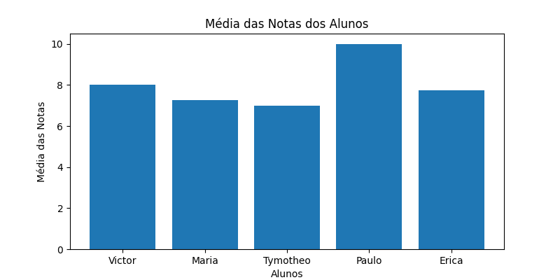
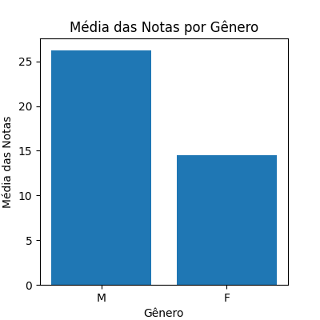

# Estatísticas de Notas dos Alunos

Este projeto em Python realiza a coleta de informações sobre alunos, incluindo nome, gênero e notas, e calcula estatísticas como média das notas individuais e média por gênero. Os resultados são visualizados por meio de gráficos.

## Capturas de Tela

### Média das Notas dos Alunos


### Média das Notas por Gênero


## Como Usar

1. Execute o script Python.
2. Insira o número de alunos e forneça as informações solicitadas para cada aluno.
3. O script calculará as médias das notas individuais e por gênero, gerando os gráficos correspondentes.

## Pré-requisitos

- Python 3.x
- Matplotlib (instalável via `pip install matplotlib`)

## Instalação

1. Clone o repositório:

```
git clone https://github.com/seu-usuario/seu-projeto.git
cd seu-projeto
```

2. Execute o script:

```
python nome_do_script.py
```

## Contribuição

Sinta-se à vontade para contribuir abrindo issues, sugerindo melhorias ou enviando pull requests.

## Licença

Este projeto é distribuído sob a licença MIT. Veja o arquivo `LICENSE` para mais detalhes.

## Contato

Para mais informações ou dúvidas, entre em contato pelo email tymotheo.dev@gmail.com.
